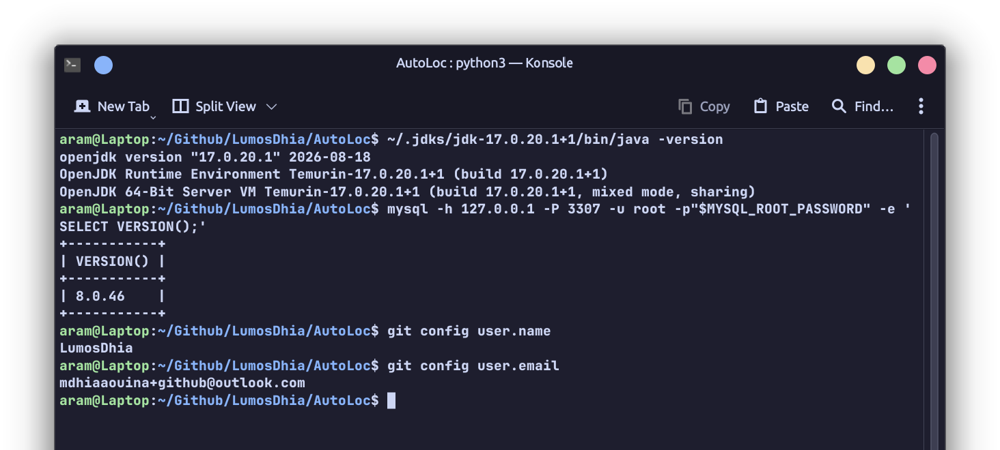
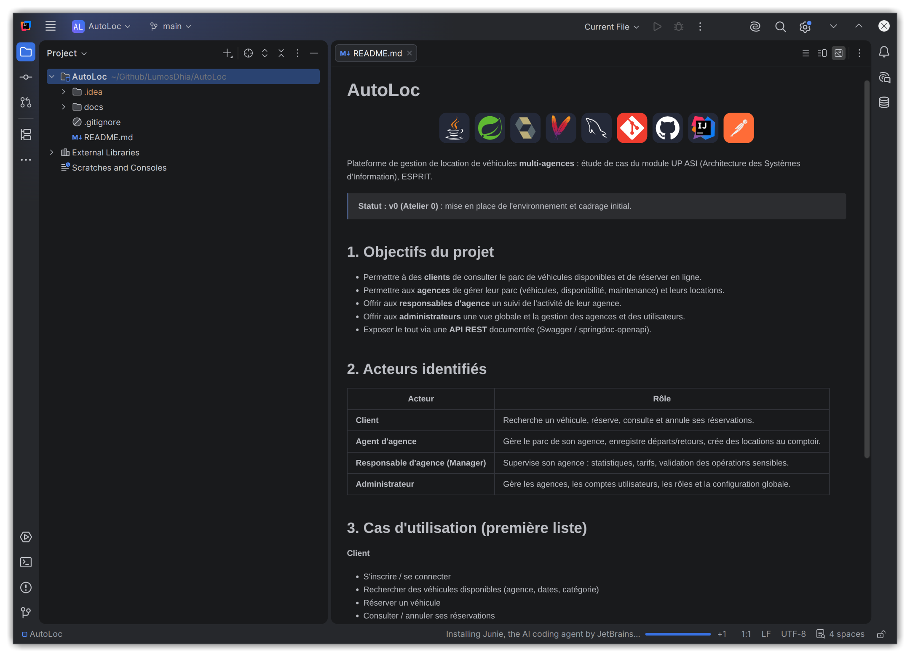
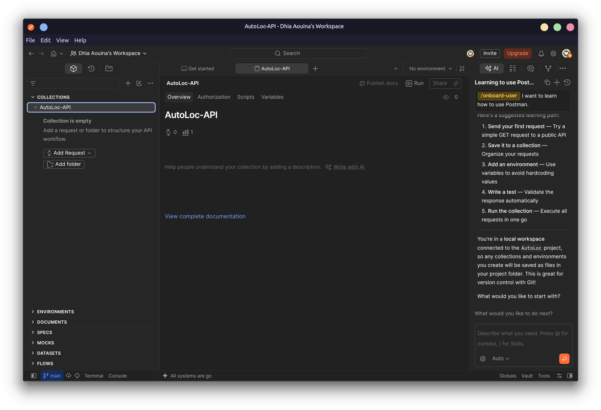

# AutoLoc

  

Plateforme de gestion de location de véhicules **multi-agences** : étude de cas du module
UP ASI (Architecture des Systèmes d'Information), ESPRIT.

> **Statut : Atelier 3** : entités JPA, couche Repository (Spring Data JPA) et couche Service.

## 1. Objectifs du projet

- Permettre à des **clients** de consulter le parc de véhicules disponibles et de réserver en ligne.
- Permettre aux **agences** de gérer leur parc (véhicules, disponibilité, maintenance) et leurs locations.
- Offrir aux **responsables d'agence** un suivi de l'activité de leur agence.
- Offrir aux **administrateurs** une vue globale et la gestion des agences et des utilisateurs.
- Exposer le tout via une **API REST** documentée (Swagger / springdoc-openapi).

## 2. Acteurs identifiés

| Acteur | Rôle |
|---|---|
| **Client** | Recherche un véhicule, réserve, consulte et annule ses réservations. |
| **Agent d'agence** | Gère le parc de son agence, enregistre départs/retours, crée des locations au comptoir. |
| **Responsable d'agence (Manager)** | Supervise son agence : statistiques, tarifs, validation des opérations sensibles. |
| **Administrateur** | Gère les agences, les comptes utilisateurs, les rôles et la configuration globale. |

## 3. Cas d'utilisation (première liste)

**Client**
- S'inscrire / se connecter
- Rechercher des véhicules disponibles (agence, dates, catégorie)
- Réserver un véhicule
- Consulter / annuler ses réservations

**Agent d'agence**
- Gérer les véhicules de l'agence (ajout, modification, retrait)
- Enregistrer la remise et le retour d'un véhicule
- Créer une location au comptoir
- Déclarer une maintenance ou un sinistre

**Responsable d'agence (Manager)**
- Consulter les statistiques de l'agence (taux d'occupation, chiffre d'affaires)
- Définir et modifier les tarifs
- Gérer les agents de son agence

**Administrateur**
- Créer et configurer les agences
- Gérer les utilisateurs et leurs rôles
- Superviser l'activité globale de la plateforme

## 4. Environnement fonctionnel

### Terminal : Java, MySQL, Git

### Base de données : MariaDB au lieu de MySQL

Le poste de développement tourne sous Debian 13, où le SGBD fourni par défaut est **MariaDB**
(le paquet `mysql` installe MariaDB). Le pilote MySQL (`mysql-connector-j`) n'arrive pas à s'y
connecter : l'application s'arrête au démarrage (`Unable to determine Dialect without JDBC metadata`).
Le projet utilise donc le pilote MariaDB.

Cela ne change rien au projet :

- MariaDB est un fork de MySQL : même langage SQL, même port (3306), mêmes types de colonnes.
- Seules deux lignes diffèrent : la dépendance `mariadb-java-client` dans `pom.xml` et le préfixe
  `jdbc:mariadb://` dans `application.properties`.
- Les entités, les annotations JPA et la configuration Hibernate restent identiques : Hibernate
  détecte le dialecte tout seul et génère les mêmes tables.

Pour revenir à MySQL, il suffit de remettre `mysql-connector-j` et `jdbc:mysql://`.

### IntelliJ IDEA Ultimate

### Postman : collection AutoLoc-API

## 5. Couches Repository et Service (Atelier 3)

### Repositories

Le package `tn.esprit.autoloc.repository` contient une interface par entité, nommée avec le
préfixe `I`. Toutes étendent `JpaRepository<Entité, Long>` : CRUD complet, `findAll` renvoie une
`List`, tri, pagination et `flush` disponibles. Aucune implémentation n'est écrite : Spring Data
génère le proxy au démarrage.

| Entité | Repository | Service |
|---|---|---|
| Agence | `IAgenceRepository` | `IAgenceService` / `AgenceServiceImpl` |
| Employe | `IEmployeRepository` | `IEmployeService` / `EmployeServiceImpl` |
| Vehicule | `IVehiculeRepository` | `IVehiculeService` / `VehiculeServiceImpl` |
| Equipement | `IEquipementRepository` | `IEquipementService` / `EquipementServiceImpl` |
| Client | `IClientRepository` | `IClientService` / `ClientServiceImpl` |
| Reservation | `IReservationRepository` | `IReservationService` / `ReservationServiceImpl` |
| Contrat | `IContratRepository` | `IContratService` / `ContratServiceImpl` |
| Paiement | `IPaiementRepository` | `IPaiementService` / `PaiementServiceImpl` |
| Maintenance | `IMaintenanceRepository` | `IMaintenanceService` / `MaintenanceServiceImpl` |

### Services

Le package `tn.esprit.autoloc.service` contient, pour chaque entité, une interface `I…Service`
et sa classe `…ServiceImpl` annotée `@Service`. Le repository est injecté par constructeur
(`@RequiredArgsConstructor`).

Le CRUD complet est écrit pour **Agence** et **Vehicule** :

| Méthode | Comportement |
|---|---|
| `addAgence` / `addVehicule` | Remet l'identifiant à `null` puis `save` : toujours un `INSERT`. |
| `updateAgence` / `updateVehicule` | Charge la ligne par son id, recopie les champs, puis `save`. Les collections (`vehicules`, `reservations`…) ne sont pas touchées. |
| `getAgenceById` / `getVehiculeById` | `findById` puis `orElseThrow` : `EntityNotFoundException` si l'id n'existe pas. |
| `getAllAgences` / `getAllVehicules` | `findAll`, renvoie une `List`. |
| `deleteAgence` / `deleteVehicule` | Vérifie `existsById` avant `deleteById`, qui ne lève plus d'exception sur un id absent depuis Spring Data 3. |

Les services des sept autres entités sont déclarés et vides : leur code métier sera ajouté à
l'Atelier 4.
